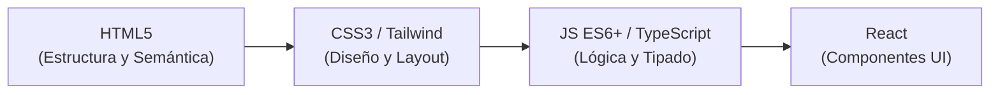
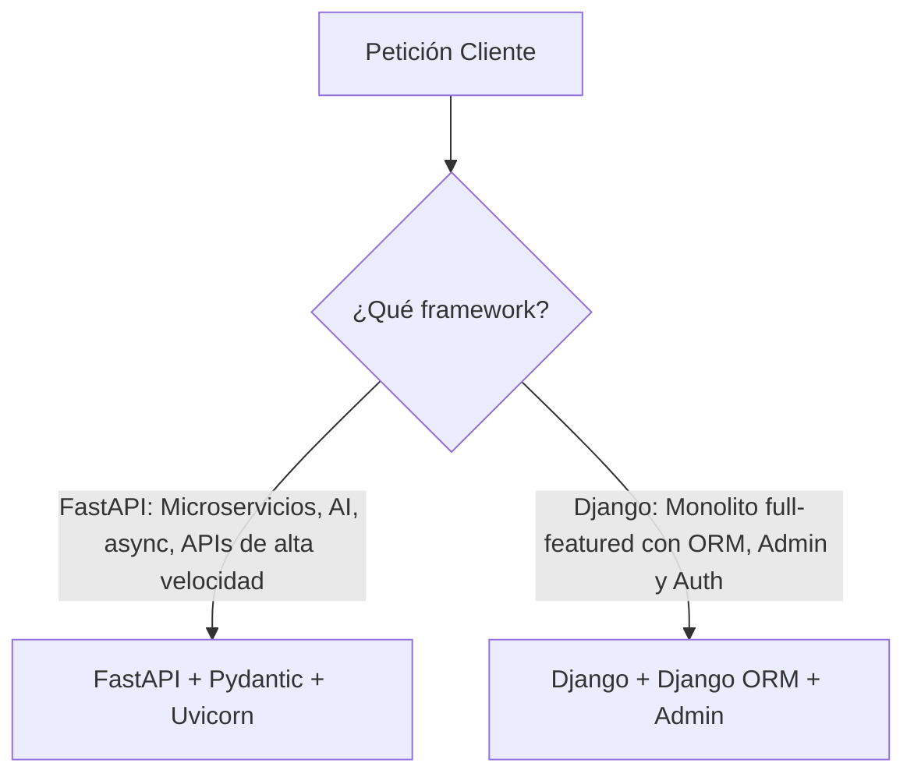
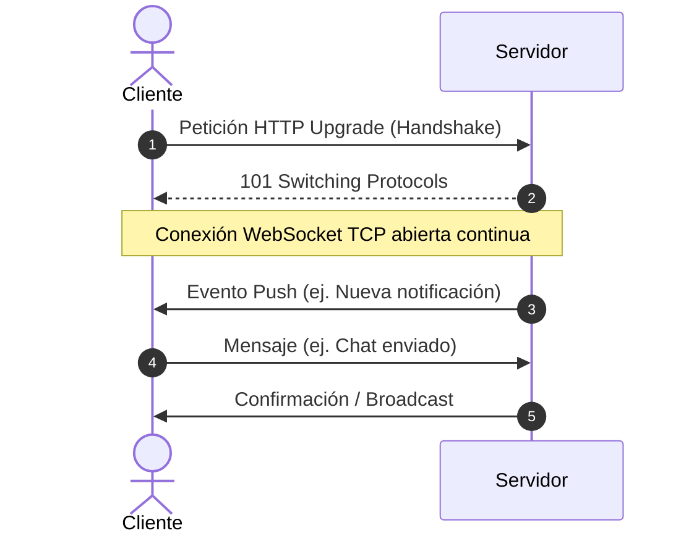
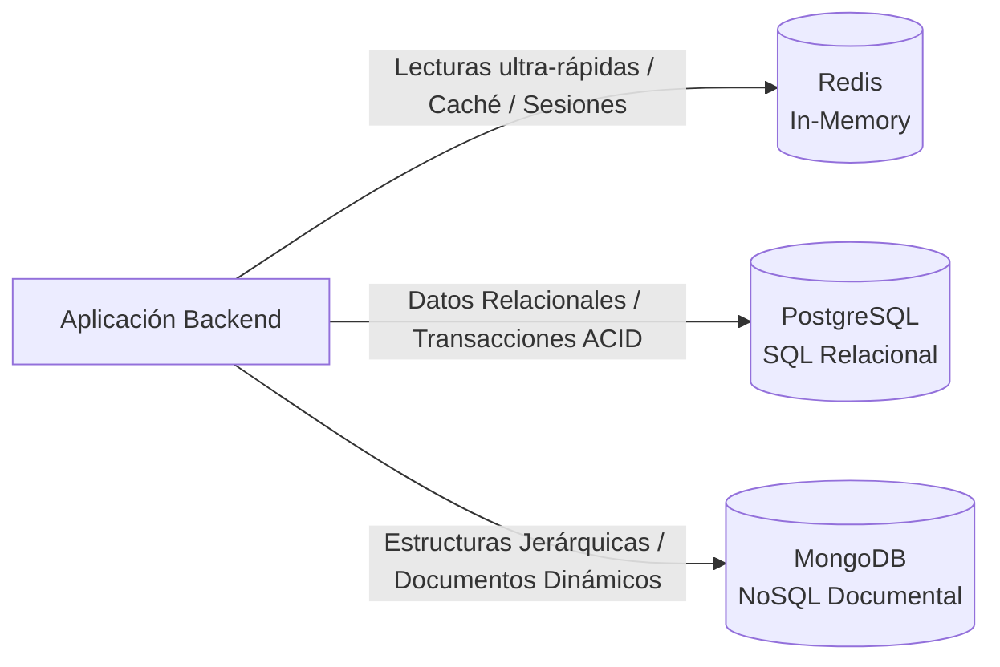
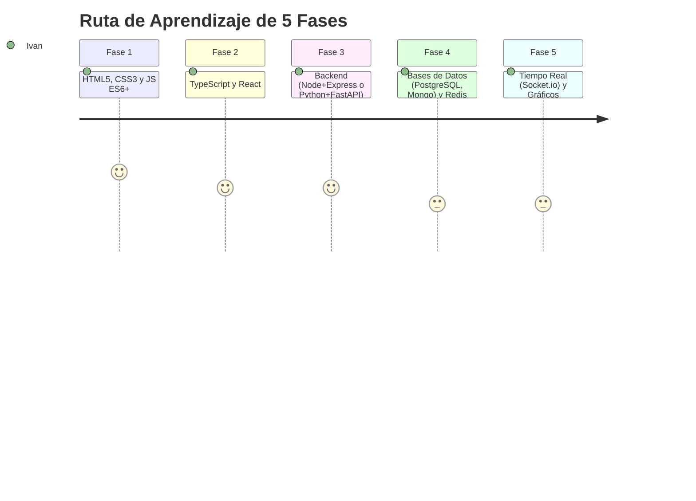

# Manual Práctico y Teórico del Stack Full-Stack Moderno

Este manual cubre las 18 tecnologías organizadas por capas de arquitectura, explicando **qué es cada una**, **cuándo aplicarla vs alternativas**, **ejemplos prácticos de código** y **cómo integrarlas entre sí**.

---

## Índice General

1. [Frontend: Fundamentos y Lenguajes](#1-frontend-fundamentos-y-lenguajes)
   - [HTML5](#html5)
   - [CSS3](#css3)
   - [JavaScript Moderno (ES6+)](#javascript-moderno-es6)
   - [TypeScript](#typescript)
   - [Tailwind CSS](#tailwind-css)
2. [Frontend: UI Reactiva y Visualización de Datos](#2-frontend-ui-reactiva-y-visualización-de-datos)
   - [React](#react)
   - [Recharts](#recharts)
   - [D3.js](#d3js)
3. [Backend: Ecosistema JavaScript / TypeScript](#3-backend-ecosistema-javascript--typescript)
   - [Node.js](#nodejs)
   - [Express](#express)
4. [Backend: Ecosistema Python](#4-backend-ecosistema-python)
   - [Python](#python)
   - [FastAPI](#fastapi)
   - [Django](#django)
5. [Comunicación Bidireccional en Tiempo Real](#5-comunicación-bidireccional-en-tiempo-real)
   - [WebSockets](#websockets)
   - [Socket.io](#socketio)
6. [Bases de Datos y Caché](#6-bases-de-datos-y-caché)
   - [PostgreSQL](#postgresql)
   - [MongoDB](#mongodb)
   - [Redis](#redis)
7. [Matriz Comparativa y Cuándo Usar Qué](#7-matriz-comparativa-y-cuándo-usar-qué)
8. [Ruta de Aprendizaje Recomendada](#8-ruta-de-aprendizaje-recomendada)

---

## 1. Frontend: Fundamentos y Lenguajes



---

### HTML5

#### ¿Qué es y Teoría?
Es el lenguaje de marcado estándar para la estructura y contenido de la web. La versión HTML5 introdujo etiquetas semánticas (`<header>`, `<main>`, `<article>`, `<section>`, `<nav>`, `<aside>`, `<footer>`), APIs del navegador (Audio/Video nativos, Canvas, Geolocation, Web Storage) y validación nativa de formularios.

#### ¿Cuándo aplicarlo?
- **Siempre**: Todo sitio o aplicación web renderiza HTML al final del día.
- Fundamental para accesibilidad (lectores de pantalla) y SEO (motores de búsqueda).

#### Ejemplo Práctico
```html
<!DOCTYPE html>
<html lang="es">
<head>
  <meta charset="UTF-8">
  <meta name="viewport" content="width=device-width, initial-scale=1.0">
  <title>Dashboard Semántico</title>
</head>
<body>
  <header>
    <nav aria-label="Principal">
      <a href="#home">Inicio</a>
      <a href="#stats">Métricas</a>
    </nav>
  </header>
  <main>
    <article>
      <h1>Resumen de Ventas</h1>
      <p>Total del mes: <data value="12500">$12,500 USD</data></p>
    </article>
  </main>
  <footer>
    <p>&copy; 2026 Mi Plataforma</p>
  </footer>
</body>
</html>
```

---

### CSS3

#### ¿Qué es y Teoría?
Es el lenguaje de hojas de estilo en cascada. CSS3 introdujo Flexbox (1D layouts), CSS Grid (2D layouts complejos), Variables CSS (`--custom-properties`), animaciones (@keyframes), transiciones suaves y media queries para diseño responsivo móvil/escritorio.

#### ¿Cuándo aplicarlo?
- En cualquier proyecto web para dar identidad visual.
- Cuando necesitas control milimétrico de animaciones complejas, micro-interacciones o maquetación responsive sin dependencias externas.

#### Ejemplo Práctico
```css
:root {
  --primary-color: #6366f1;
  --bg-dark: #0f172a;
  --text-light: #f8fafc;
}

.dashboard-card {
  display: flex;
  flex-direction: column;
  background-color: var(--bg-dark);
  color: var(--text-light);
  border-radius: 12px;
  padding: 1.5rem;
  transition: transform 0.2s ease, box-shadow 0.2s ease;
}

.dashboard-card:hover {
  transform: translateY(-4px);
  box-shadow: 0 10px 25px -5px rgba(99, 102, 241, 0.3);
}

/* Grid responsivo */
.grid-container {
  display: grid;
  grid-template-columns: repeat(auto-fit, minmax(280px, 1fr));
  gap: 1.5rem;
}
```

---

### JavaScript Moderno (ES6+)

#### ¿Qué es y Teoría?
ECMAScript 6 (2015) y versiones posteriores transformaron JS en un lenguaje moderno con:
- Declaración de variables: `const` y `let` (alcance de bloque).
- Arrow functions (`() => {}`).
- Desestructuración (`const { name, age } = user`).
- Módulos nativos (`import` / `export`).
- Promesas y `async / await` para flujos asíncronos limpios.
- Métodos de arreglos funcionales: `.map()`, `.filter()`, `.reduce()`, `.find()`.
- Optional Chaining (`user?.address?.city`) y Nullish Coalescing (`value ?? 'default'`).

#### ¿Cuándo aplicarlo?
- En el frontend para manipular el DOM, manejar eventos de usuario y consumir APIs REST.
- En el backend mediante Node.js.

#### Ejemplo Práctico
```javascript
// Consumo asíncrono con async/await y métodos funcionales
async function fetchTopUsers(minPoints = 100) {
  try {
    const response = await fetch('https://api.example.com/users');
    if (!response.ok) throw new Error(`HTTP error: ${response.status}`);

    const users = await response.json();

    // Filtrar, transformar y ordenar
    const topPerformers = users
      .filter(user => (user?.score ?? 0) >= minPoints)
      .map(({ id, name, score }) => ({
        id,
        fullName: name.toUpperCase(),
        score
      }))
      .sort((a, b) => b.score - a.score);

    return topPerformers;
  } catch (error) {
    console.error('Error al obtener usuarios:', error.message);
    return [];
  }
}
```

---

### TypeScript

#### ¿Qué es y Teoría?
TypeScript es un **superset tipado de JavaScript** desarrollado por Microsoft que compila a JavaScript puro. Agrega tipado estático opcional, interfaces, tipos genéricos, tuplas y enums. Errores que antes ocurrían en tiempo de ejecución en producción se detectan al momento de escribir el código en el editor.

#### ¿Cuándo aplicarlo?
- **Proyectos medianos y grandes**: Evita bugs de propiedades indefinidas (`TypeError: Cannot read properties of undefined`).
- **Equipos de más de 1 persona**: El tipado actúa como documentación viva autocompletable.
- **APIs y SDKs**: Define contratos claros para datos de entrada y salida.

#### Ejemplo Práctico
```typescript
interface UserProfile {
  id: string;
  name: string;
  email: string;
  role: 'admin' | 'editor' | 'viewer';
  lastLogin?: Date;
}

class UserService {
  private users: Map<string, UserProfile> = new Map();

  addUser(user: UserProfile): void {
    this.users.set(user.id, user);
  }

  getUserRole(id: string): UserProfile['role'] | null {
    const user = this.users.get(id);
    return user ? user.role : null;
  }
}

const service = new UserService();
service.addUser({
  id: "u-101",
  name: "Ivan",
  email: "ivan@example.com",
  role: "admin"
});
```

---

### Tailwind CSS

#### ¿Qué es y Teoría?
Es un framework CSS orientado a **utilidades de bajo nivel** (*utility-first*). En lugar de crear clases semánticas gigantescas como `.card-button-primary`, compones clases atómicas predefinidas en el propio HTML/JSX (`flex`, `p-4`, `bg-indigo-600`, `rounded-xl`, `hover:scale-105`).

#### ¿Cuándo aplicarlo?
- Proyectos React, Vue, Next.js donde quieres alta velocidad de diseño y consistencia sin saltar entre archivos CSS y JSX.
- Para crear sistemas de diseño con modo oscuro nativo (`dark:bg-slate-900`) y breakpoints responsivos (`md:flex`, `lg:grid-cols-3`).

#### Ejemplo Práctico
```html
<div class="max-w-md mx-auto p-6 bg-slate-900 text-white rounded-2xl shadow-xl border border-slate-800 transition hover:border-indigo-500">
  <div class="flex items-center space-x-4">
    <div class="h-12 w-12 rounded-full bg-indigo-500/20 flex items-center justify-center text-indigo-400 font-bold">
      TS
    </div>
    <div>
      <h3 class="text-lg font-semibold tracking-tight">TypeScript Server</h3>
      <span class="inline-flex items-center px-2.5 py-0.5 rounded-full text-xs font-medium bg-emerald-500/10 text-emerald-400">
        Activo
      </span>
    </div>
  </div>
  <button class="mt-4 w-full py-2 px-4 bg-indigo-600 hover:bg-indigo-500 active:scale-95 transition-all text-white font-medium rounded-lg text-sm shadow-md">
    Ver Detalles
  </button>
</div>
```

---

## 2. Frontend: UI Reactiva y Visualización de Datos

### React

#### ¿Qué es y Teoría?
Librería declarativa de JavaScript basada en componentes y Virtual DOM. Los componentes responden a cambios de **estado (`useState`)** y ejecutan efectos secundarios (`useEffect`). React optimiza los repintados del navegador actualizando solo los nodos que realmente cambiaron.

#### ¿Cuándo aplicarlo?
- Aplicaciones web de una sola página (SPA) interactivas: tableros de control, paneles de usuario, feeds sociales, plataformas de e-commerce.

#### Ejemplo Práctico
```tsx
import React, { useState, useEffect } from 'react';

interface MetricProps {
  label: string;
  initialValue: number;
}

export const LiveCounter: React.FC<MetricProps> = ({ label, initialValue }) => {
  const [count, setCount] = useState<number>(initialValue);

  return (
    <div className="p-4 bg-slate-800 rounded-lg border border-slate-700">
      <p className="text-sm text-slate-400">{label}</p>
      <h2 className="text-3xl font-bold text-white mt-1">{count}</h2>
      <div className="flex gap-2 mt-3">
        <button 
          onClick={() => setCount(prev => prev + 1)}
          className="px-3 py-1 bg-blue-600 hover:bg-blue-500 text-white rounded text-sm"
        >
          Incrementar
        </button>
        <button 
          onClick={() => setCount(0)}
          className="px-3 py-1 bg-slate-700 hover:bg-slate-600 text-white rounded text-sm"
        >
          Reset
        </button>
      </div>
    </div>
  );
};
```

---

### Recharts

#### ¿Qué es y Teoría?
Es una biblioteca de gráficos declarativos construida **específicamente sobre React y componentes SVG**. Provee primitivas componibles (`<ResponsiveContainer>`, `<LineChart>`, `<XAxis>`, `<Tooltip>`, `<CartesianGrid>`).

#### ¿Cuándo aplicarlo?
- Gráficos estándar de negocios en proyectos React: líneas temporales, barras comparativas, gráficos de pastel, áreas de ingresos.
- Cuando quieres gráficos elegantes, responsivos y con tooltips interactivos sin escribir código SVG manual.

#### Ejemplo Práctico
```tsx
import React from 'react';
import { ResponsiveContainer, AreaChart, Area, XAxis, YAxis, Tooltip, CartesianGrid } from 'recharts';

const data = [
  { mes: 'Ene', visitas: 4000, ventas: 2400 },
  { mes: 'Feb', visitas: 3000, ventas: 1398 },
  { mes: 'Mar', visitas: 2000, ventas: 9800 },
  { mes: 'Abr', visitas: 2780, ventas: 3908 },
  { mes: 'May', visitas: 1890, ventas: 4800 },
];

export const RevenueChart: React.FC = () => {
  return (
    <div className="w-full h-72 bg-slate-900 p-4 rounded-xl">
      <h3 className="text-white font-semibold mb-2">Tráfico vs Ventas</h3>
      <ResponsiveContainer width="100%" height="90%">
        <AreaChart data={data}>
          <CartesianGrid strokeDasharray="3 3" stroke="#334155" />
          <XAxis dataKey="mes" stroke="#94a3b8" />
          <YAxis stroke="#94a3b8" />
          <Tooltip 
            contentStyle={{ backgroundColor: '#1e293b', border: 'none', borderRadius: '8px', color: '#fff' }} 
          />
          <Area type="monotone" dataKey="ventas" stroke="#818cf8" fill="#818cf8" fillOpacity={0.2} />
          <Area type="monotone" dataKey="visitas" stroke="#38bdf8" fill="#38bdf8" fillOpacity={0.2} />
        </AreaChart>
      </ResponsiveContainer>
    </div>
  );
};
```

---

### D3.js (Data-Driven Documents)

#### ¿Qué es y Teoría?
D3 no es solo una librería de gráficos: es un **motor matemático de bajo nivel para enlazar datos arbitrarios al DOM y manipular SVGs, Canvas o HTML**. Te da control absoluto sobre escalas matemáticas (`d3.scaleLinear`, `d3.scaleTime`), proyecciones geográficas, grafos de nodos y físicas de partículas.

#### ¿Cuándo aplicarlo?
- Cuando necesitas visualizaciones personalizadas no estándar: árboles jerárquicos (treemaps), grafos de redes interconectadas por fuerza (force-directed graphs), mapas geoespaciales interactivos o diagramas Sankey.
- *Regla*: Si es un gráfico de barras o líneas, usa **Recharts**. Si es un mapa de red molecular o visualización científica a medida, usa **D3.js**.

#### Ejemplo Práctico (D3 dentro de un `useEffect` de React)
```tsx
import React, { useRef, useEffect } from 'react';
import * as d3 from 'd3';

export const D3BarChart: React.FC = () => {
  const svgRef = useRef<SVGSVGElement | null>(null);
  const data = [25, 45, 80, 55, 90, 30];

  useEffect(() => {
    if (!svgRef.current) return;
    const svg = d3.select(svgRef.current);
    svg.selectAll("*").remove(); // Limpiar previos

    const width = 300;
    const height = 150;
    const barWidth = width / data.length;

    const yScale = d3.scaleLinear()
      .domain([0, d3.max(data) || 100])
      .range([0, height]);

    svg.attr("width", width).attr("height", height);

    svg.selectAll("rect")
      .data(data)
      .enter()
      .append("rect")
      .attr("x", (_, i) => i * barWidth)
      .attr("y", d => height - yScale(d))
      .attr("width", barWidth - 4)
      .attr("height", d => yScale(d))
      .attr("fill", "#6366f1")
      .attr("rx", 4);
  }, [data]);

  return <svg ref={svgRef} className="bg-slate-900 p-2 rounded-lg" />;
};
```

---

## 3. Backend: Ecosistema JavaScript / TypeScript

### Node.js

#### ¿Qué es y Teoría?
Entorno de ejecución (*runtime*) que permite ejecutar JavaScript fuera del navegador. Funciona con el motor V8 de Google y utiliza una arquitectura basada en **bucle de eventos (Event Loop) asíncrono y de un solo hilo con operaciones I/O no bloqueantes**.
- Ideal para manejar miles de conexiones concurrentes esperando datos de red o disco sin saturar hilos de CPU.

#### ¿Cuándo aplicarlo?
- Servicios API REST o GraphQL.
- Microservicios de streaming o mensajería en tiempo real.
- Aplicaciones donde se comparte el mismo lenguaje (TypeScript/JS) entre Frontend y Backend.

---

### Express

#### ¿Qué es y Teoría?
Es el framework web minimalista más popular para Node.js. Su arquitectura gira en torno al patrón **Middleware**: funciones con la firma `(req, res, next) => {}` que interceptan y transforman la petición antes de devolver la respuesta.

#### ¿Cuándo aplicarlo?
- Creación rápida de APIs RESTful, proxies inversos y servidores de autenticación.

#### Ejemplo Práctico (Express + TypeScript)
```typescript
import express, { Request, Response, NextFunction } from 'express';

const app = express();
app.use(express.json());

// Middleware de Logging
app.use((req: Request, _res: Response, next: NextFunction) => {
  console.log(`[${new Date().toISOString()}] ${req.method} ${req.url}`);
  next();
});

interface Item {
  id: number;
  title: string;
}

const items: Item[] = [{ id: 1, title: 'Aprender TypeScript' }];

// Endpoint GET
app.get('/api/items', (_req: Request, res: Response) => {
  res.json({ success: true, count: items.length, data: items });
});

// Endpoint POST
app.post('/api/items', (req: Request, res: Response) => {
  const { title } = req.body;
  if (!title) {
    return res.status(400).json({ error: 'El campo "title" es requerido' });
  }

  const newItem: Item = { id: items.length + 1, title };
  items.push(newItem);
  res.status(201).json(newItem);
});

app.listen(3000, () => {
  console.log('Servidor Express corriendo en http://localhost:3000');
});
```

---

## 4. Backend: Ecosistema Python



---

### Python

#### ¿Qué es y Teoría?
Lenguaje de programación interpretado, dinámico, de alto nivel y fuertemente tipado. Destaca por su sintaxis legible, amplio ecosistema de paquetes (PyPI) y dominio absoluto en Inteligencia Artificial, Ciencia de Datos y Automatización.

#### ¿Cuándo aplicarlo?
- Backend de APIs modernas (FastAPI/Django).
- Procesamiento de datos masivo, Machine Learning, scrapers y scripts de mantenimiento.

---

### FastAPI

#### ¿Qué es y Teoría?
Framework web moderno para construir APIs con Python 3.8+ basado en estándares:
- **Pydantic**: Validación de datos y esquemas tipados automáticos.
- **Starlette**: Motor ASGI asíncrono (`async/await`) de muy alto rendimiento (a la par de Node.js y Go).
- **OpenAPI & Swagger**: Genera documentación interactiva automática en `/docs`.

#### ¿Cuándo aplicarlo?
- Microservicios de alto rendimiento y APIs REST JSON modernas.
- Servicios que integran modelos de Machine Learning / IA (PyTorch, TensorFlow, LangChain).
- Cuando quieres validación estricta de datos de entrada/salida sin escribir validadores a mano.

#### Ejemplo Práctico
```python
from fastapi import FastAPI, HTTPException, status
from pydantic import BaseModel, Field, EmailStr
from typing import List

app = FastAPI(title="Plataforma API", version="1.0.0")

class UserCreate(BaseModel):
    username: str = Field(..., min_length=3, max_length=50)
    email: EmailStr
    age: int = Field(..., ge=18, description="Debe ser mayor de edad")

class UserResponse(UserCreate):
    id: int

db_users: List[UserResponse] = []

@app.post("/users", response_model=UserResponse, status_code=status.HTTP_201_CREATED)
async def create_user(user: UserCreate):
    new_user = UserResponse(id=len(db_users) + 1, **user.model_dump())
    db_users.append(new_user)
    return new_user

@app.get("/users/{user_id}", response_model=UserResponse)
async def get_user(user_id: int):
    for u in db_users:
        if u.id == user_id:
            return u
    raise HTTPException(status_code=404, detail="Usuario no encontrado")

# Ejecutar con: uvicorn main:app --reload
```

---

### Django

#### ¿Qué es y Teoría?
El framework backend más maduro de Python bajo la filosofía *"Batteries Included"* (Todo incluido). Provee de fábrica:
- ORM propio para mapear modelos a bases de datos relacionales sin SQL crudo.
- Panel de Administración interactivo autogenerado (`django-admin`).
- Sistema completo de autenticación de usuarios, permisos y sesiones.
- Protección contra CSRF, SQL Injection y XSS incorporada.

#### ¿Cuándo aplicarlo?
- Aplicaciones monolíticas completas donde necesitas arrancar rápido: portales SaaS con autenticación, paneles de administración, blogs complejos o marketplaces.
- Cuando prefieres una solución todo-en-uno estandarizada en lugar de ensamblar múltiples librerías.

#### Ejemplo Práctico (Django Model y View)
```python
# models.py
from django.db import models

class Product(models.Model):
    title = models.CharField(max_length=200)
    price = models.DecimalField(max_digits=10, decimal_places=2)
    stock = models.PositiveIntegerField(default=0)
    created_at = models.DateTimeField(auto_now_add=True)

    def __str__(self):
        return self.title

# views.py (API JSON básica)
from django.http import JsonResponse
from .models import Product

def list_products(request):
    products = Product.objects.filter(stock__gt=0).values('id', 'title', 'price')
    return JsonResponse(list(products), safe=False)
```

---

## 5. Comunicación Bidireccional en Tiempo Real



---

### WebSockets (Protocolo Nativo)

#### ¿Qué es y Teoría?
Es un protocolo estándar de comunicación TCP (`ws://` o `wss://`) que establece un canal bidireccional continuo (*full-duplex*) sobre una única conexión. A diferencia de HTTP (donde el cliente pide y el servidor responde), en WebSockets cualquiera de los dos extremos puede emitir datos en cualquier instante con una sobrecarga de cabeceras mínima.

#### ¿Cuándo aplicarlo?
- Transmisión cruda de datos financieros (tickers de cripto/acciones).
- Juegos multijugador online.
- Sensores IoT donde los paquetes deben ser lo más livianos posibles.

#### Ejemplo Práctico (Servidor nativo con paquete `ws` en Node.js)
```javascript
import { WebSocketServer } from 'ws';

const wss = new WebSocketServer({ port: 8080 });

wss.on('connection', (ws) => {
  console.log('Cliente conectado');

  ws.on('message', (message) => {
    console.log(`Mensaje recibido: ${message}`);
    // Responder solo al emisor
    ws.send(JSON.stringify({ type: 'ECHO', payload: message.toString() }));
  });

  ws.on('close', () => console.log('Cliente desconectado'));
});
```

---

### Socket.io

#### ¿Qué es y Teoría?
Es una **biblioteca de alto nivel** construida por encima de WebSockets. Agrega:
- Mecanismo de fallback a HTTP Long-Polling si la red del cliente bloquea WebSockets.
- Reconexión automática con backoff exponencial.
- Concepto de **Salas (`Rooms`)** y **Espacios de nombres (`Namespaces`)** para agrupar usuarios (ej: canales de chat).
- Transmisión multidifusión (*broadcasting*) sencilla.

#### ¿Cuándo aplicarlo?
- Aplicaciones de chat grupal, notificaciones push colaborativas tipo Slack/Notion, pizarras interactivas compartidas.
- Cuando necesitas confiabilidad de conexión garantizada en cualquier navegador o red móvil sin reinventar la rueda de reconexiones.

#### Ejemplo Práctico (Socket.io Server + Client)

**Servidor (Node.js):**
```javascript
import { createServer } from 'http';
import { Server } from 'socket.io';

const httpServer = createServer();
const io = new Server(httpServer, {
  cors: { origin: '*' }
});

io.on('connection', (socket) => {
  console.log(`Usuario conectado: ${socket.id}`);

  // Unirse a una sala específica
  socket.on('join_room', (roomName) => {
    socket.join(roomName);
    console.log(`Socket ${socket.id} se unió a la sala ${roomName}`);
  });

  // Emitir mensaje solo a esa sala
  socket.on('send_message', ({ room, message }) => {
    io.to(room).emit('new_message', {
      sender: socket.id,
      text: message,
      timestamp: new Date().toISOString()
    });
  });
});

httpServer.listen(4000, () => console.log('Socket.io en http://localhost:4000'));
```

**Cliente (React):**
```tsx
import React, { useEffect, useState } from 'react';
import { io, Socket } from 'socket.io-client';

const socket: Socket = io('http://localhost:4000');

export const ChatWidget: React.FC = () => {
  const [messages, setMessages] = useState<string[]>([]);
  const [input, setInput] = useState('');

  useEffect(() => {
    socket.emit('join_room', 'general');

    socket.on('new_message', (data: { text: string }) => {
      setMessages(prev => [...prev, data.text]);
    });

    return () => {
      socket.off('new_message');
    };
  }, []);

  const handleSend = () => {
    if (input.trim()) {
      socket.emit('send_message', { room: 'general', message: input });
      setInput('');
    }
  };

  return (
    <div className="p-4 bg-slate-900 text-white rounded-lg">
      <div className="h-40 overflow-y-auto mb-2 border border-slate-700 p-2">
        {messages.map((msg, i) => <p key={i} className="text-sm">{msg}</p>)}
      </div>
      <input 
        value={input} 
        onChange={e => setInput(e.target.value)} 
        className="px-2 py-1 bg-slate-800 text-white rounded mr-2"
        placeholder="Escribe un mensaje..."
      />
      <button onClick={handleSend} className="px-3 py-1 bg-indigo-600 rounded">Enviar</button>
    </div>
  );
};
```

---

## 6. Bases de Datos y Caché



---

### PostgreSQL

#### ¿Qué es y Teoría?
El motor de base de datos relacional (RDBMS) de código abierto más avanzado del mundo. Ofrece cumplimiento total de **ACID** (Atomicidad, Consistencia, Aislamiento, Durabilidad), soporte para tipos JSONB avanzados, extensiones como PostGIS (geoespacial) y búsquedas de texto completo (*Full-Text Search*).

#### ¿Cuándo aplicarlo?
- Sistemas financieros, transacciones comerciales, inventarios, ERPs y cualquier sistema donde la integridad de los datos y las relaciones entre tablas (claves foráneas) sean sagradas.

#### Ejemplo Práctico (SQL)
```sql
-- Creación de tabla con claves foráneas e integridad
CREATE TABLE accounts (
  id UUID PRIMARY KEY DEFAULT gen_random_uuid(),
  email VARCHAR(255) UNIQUE NOT NULL,
  balance NUMERIC(12, 2) NOT NULL DEFAULT 0.00 CHECK (balance >= 0),
  created_at TIMESTAMPTZ DEFAULT NOW()
);

CREATE TABLE transactions (
  id UUID PRIMARY KEY DEFAULT gen_random_uuid(),
  account_id UUID REFERENCES accounts(id) ON DELETE CASCADE,
  amount NUMERIC(12, 2) NOT NULL,
  category VARCHAR(50),
  created_at TIMESTAMPTZ DEFAULT NOW()
);

-- Consulta analítica con JOIN y agregación
SELECT 
  a.email, 
  COUNT(t.id) AS total_transacciones, 
  COALESCE(SUM(t.amount), 0) AS total_gastado
FROM accounts a
LEFT JOIN transactions t ON a.id = t.account_id
GROUP BY a.id, a.email;
```

---

### MongoDB

#### ¿Qué es y Teoría?
Base de datos **NoSQL orientada a documentos** en formato BSON (JSON binario). No requiere un esquema rígido predefined (*schemaless* o esquema flexible), lo que permite que cada documento dentro de una colección tenga campos y estructuras anidadas diferentes.

#### ¿Cuándo aplicarlo?
- Catálogos de productos con atributos variables (ropa con tallas/colores vs electrónicos con voltaje/batería).
- Registros de logs, eventos y analíticas de navegación.
- Prototipado rápido donde el modelo de datos cambia constantemente.

#### Ejemplo Práctico (Mongoose con Node.js)
```typescript
import mongoose, { Schema, Document } from 'mongoose';

interface IProduct extends Document {
  sku: string;
  name: string;
  metadata: Record<string, any>;
  tags: string[];
}

const ProductSchema = new Schema<IProduct>({
  sku: { type: String, required: true, unique: true },
  name: { type: String, required: true },
  metadata: { type: Schema.Types.Mixed }, // Esquema libre y dinámico
  tags: [{ type: String }]
});

const ProductModel = mongoose.model<IProduct>('Product', ProductSchema);

// Inserción de documento flexible
async function createSampleProduct() {
  await ProductModel.create({
    sku: "LAPTOP-01",
    name: "Ultrabook 14 pulgadas",
    metadata: {
      ram_gb: 16,
      processor: "Apple M3",
      ports: ["USB-C", "HDMI"]
    },
    tags: ["tech", "portatil", "nuevo"]
  });
}
```

---

### Redis (Remote Dictionary Server)

#### ¿Qué es y Teoría?
Almacén de datos **en memoria RAM clave-valor** de velocidad extrema (sub-milisegundo). Soporta estructuras complejas (strings, hashes, listas, conjuntos ordenados) y cuenta con mecanismos de persistencia en disco opcional y sistema de mensajería Pub/Sub.

#### ¿Cuándo aplicarlo?
1. **Caché**: Guardar resultados de consultas pesadas a PostgreSQL para no consultar la base de datos en cada visita.
2. **Sesiones y Tokens**: Guardar tokens JWT invalidados o sesiones activas con tiempo de expiración automático (TTL).
3. **Rate Limiting**: Limitar el número de peticiones por segundo que un cliente puede hacer a tu API.

#### Ejemplo Práctico (Caché con Node.js)
```typescript
import { createClient } from 'redis';

const redisClient = createClient({ url: 'redis://localhost:6379' });
await redisClient.connect();

async function getCachedData(key: string, fetchDbCallback: () => Promise<any>, ttlSeconds = 60) {
  // 1. Verificar si existe en caché Redis
  const cached = await redisClient.get(key);
  if (cached) {
    console.log('⚡ Hit en Redis Caché');
    return JSON.parse(cached);
  }

  // 2. Si no está, consultar la base de datos
  console.log('🐢 Miss en caché, consultando BD...');
  const freshData = await fetchDbCallback();

  // 3. Guardar en Redis con expiración automática (TTL)
  await redisClient.set(key, JSON.stringify(freshData), { EX: ttlSeconds });

  return freshData;
}
```

---

## 7. Matriz Comparativa y Cuándo Usar Qué

| Tecnología A | Tecnología B | ¿Cuándo elegir A? | ¿Cuándo elegir B? |
| :--- | :--- | :--- | :--- |
| **FastAPI** | **Django** | Microservicios, alto rendimiento async, integración con IA/ML, APIs puras. | Monolitos con panel de administración, autenticación lista, proyectos completos con ORM propio. |
| **FastAPI** | **Express** | Si tu equipo domina Python o trabajas con pipelines de datos y modelos ML. | Si quieres unificar el stack completo en TypeScript tanto en cliente como en servidor. |
| **PostgreSQL** | **MongoDB** | Datos relacionales estructurados, transacciones financieras, integridad estricta. | Documentos jerárquicos variables, catálogos heterogéneos, prototipos de esquema cambiante. |
| **WebSockets** | **Socket.io** | Transmisión binaria de ultra bajo consumo, streaming IoT, protocolos estándar. | Chats, tableros colaborativos, soporte automático de reconexión y salas por nombre. |
| **Recharts** | **D3.js** | Gráficos convencionales (líneas, barras, pie) en React de forma rápida y limpia. | Gráficos no estándar, grafos de nodos interactivos, visualizaciones matemáticas a medida. |
| **Tailwind CSS** | **CSS3 Puro** | Desarrollo ágil en componentes React sin duplicar código CSS; diseño responsivo rápido. | Sitios estáticos sin bundlers, animaciones extremadamente personalizadas con `@keyframes`. |

---

## 8. Ruta de Aprendizaje Recomendada

Para no abrumarte, sigue este orden por fases incrementales:



1. **Fase 1: Fundamentos Web** (HTML5 Semántico $\rightarrow$ CSS3 Flexbox/Grid $\rightarrow$ JavaScript ES6+ asíncrono).
2. **Fase 2: Frontend Moderno y Tipado** (TypeScript $\rightarrow$ Tailwind CSS $\rightarrow$ React Hooks).
3. **Fase 3: Backend & APIs** (Elige un camino: Node.js + Express con TypeScript **o** Python + FastAPI).
4. **Fase 4: Persistencia & Rendimiento** (PostgreSQL para datos core $\rightarrow$ MongoDB para documentos flexibles $\rightarrow$ Redis para caché).
5. **Fase 5: Especialización** (Tiempo real con Socket.io/WebSockets $\rightarrow$ Dashboards con Recharts y D3.js).
