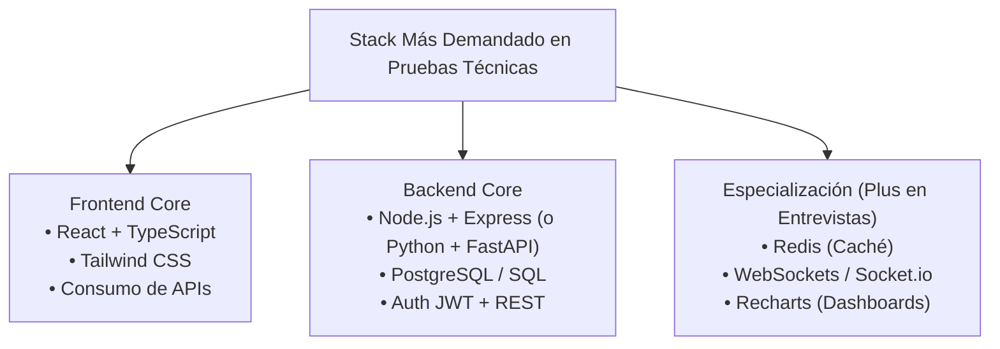

# Guía de Preparación para Pruebas Técnicas Full-Stack

Esta guía detalla **qué priorizar**, **qué evalúan realmente las empresas**, **los 3 formatos habituales de pruebas técnicas** y **los ejercicios y preguntas más recurrentes**.

---

## 1. ¿Qué aprender primero? (La regla del 80/20)

No intentes aprender las 18 tecnologías al mismo tiempo. El 80% de las ofertas del mercado se concentran en uno de estos dos núcleos:



> [!IMPORTANT]
> **El estándar indiscutido hoy es TypeScript**. Si sabes JavaScript pero no TypeScript, estás en desventaja frente a candidatos que tipan sus componentes y modelos.

---

## 2. Los 3 Formatos de Pruebas Técnicas

| Formato | ¿En qué consiste? | ¿Qué evalúan? | Tiempo típico |
| :--- | :--- | :--- | :--- |
| **Take-Home Project** (Prueba para casa) | Te dan una consigna (ej. *"Crea un mini dashboard de tareas con filtros y persistencia"*). | Arquitectura limpia, manejo de errores, Git commits claros, README con instrucciones de setup. | 48 a 72 horas |
| **Live Coding / Pair Programming** | Compartes pantalla con un evaluador y resuelves un problema en vivo. | Comunicación verbal (*pensar en voz alta*), depuración de errores bajo presión, dominio de métodos de arreglos y tipado. | 45 a 60 min |
| **Entrevista Teórica / Deep Dive** | Preguntas conceptuales y casos de diseño (*"¿Qué pasa si 10,000 usuarios consultan esta ruta a la vez?"*). | Entendimiento de fundamentos (Event Loop, Índices SQL, Re-renders en React). | 30 a 45 min |

---

## 3. Lo que toman por tecnología

### A. JavaScript (ES6+) y TypeScript
**Lo que siempre preguntan:**
- **Event Loop & Asincronismo**: Microtasks vs Macrotasks (`Promise.then` vs `setTimeout`).
- **Manipulación funcional de datos**: `.map()`, `.filter()`, `.reduce()` (te pedirán agrupar o transformar datos sin mutar el original).
- **TypeScript**: Diferencia entre `interface` y `type`, genéricos básicos (`<T>`), tipar eventos del DOM (`React.ChangeEvent<HTMLInputElement>`).

**Ejercicio típico de Live Coding:**
> *"Dado un array de transacciones con montos y categorías, devuelve un objeto con el gasto total agrupado por categoría."*

```typescript
type Transaction = { id: string; category: string; amount: number };

const transactions: Transaction[] = [
  { id: "1", category: "comida", amount: 15 },
  { id: "2", category: "transporte", amount: 10 },
  { id: "3", category: "comida", amount: 25 },
];

// Solución esperada con .reduce()
const totalsByCategory = transactions.reduce<Record<string, number>>((acc, curr) => {
  acc[curr.category] = (acc[curr.category] ?? 0) + curr.amount;
  return acc;
}, {});
// Resultado: { comida: 40, transporte: 10 }
```

---

### B. React
**Lo que siempre preguntan:**
1. **Ciclo de vida y Hooks**:
   - ¿Por qué un componente se renderiza de más? (Problemas con dependencias en `useEffect`).
   - ¿Cuándo usar `useMemo` y `useCallback`? (Para no recrear funciones o cálculos pesados pasados como props a componentes memorizados).
   - Levantamiento de estado (*Lifting State Up*) y Context API vs prop drilling.
2. **Manejo de Estados Asíncronos**:
   - Estados indispensables en cualquier vista con API: `{ loading: boolean, error: string | null, data: T | null }`.

**Ejercicio típico de Take-Home / Live:**
> *"Crea una tabla con buscador en tiempo real (debounced search), paginación y ordenamiento ascendente/descendente."*

---

### C. Backend (Express o FastAPI)
**Lo que siempre preguntan:**
1. **Estructura de arquitectura**:
   - Separación de responsabilidades: Rutas $\rightarrow$ Controladores $\rightarrow$ Servicios $\rightarrow$ Modelos.
2. **Autenticación y Seguridad**:
   - Flujo de JWT (Access Token vs Refresh Token), hashing de contraseñas con `bcrypt` (¡nunca guardar contraseñas en texto plano!).
   - Middlewares para proteger rutas privadas y sanitización de inputs.
3. **Manejo centralizado de errores**:
   - No usar `try/catch` repetitivos sin un middleware o exception handler global que devuelva un formato JSON estándar (`{ success: false, message: "..." }`).

**Ejercicio típico:**
> *"Implementa un CRUD con autenticación Bearer Token y paginación (`limit`, `offset` o `page`, `pageSize`)."*

---

### D. Bases de Datos (PostgreSQL & Redis)
**Lo que siempre preguntan:**
1. **SQL (PostgreSQL)**:
   - Diferencia entre `INNER JOIN`, `LEFT JOIN` y `FULL JOIN`.
   - ¿Qué es un índice en base de datos y cómo acelera las lecturas a costa de ralentizar las inserciones?
   - Transacciones: ¿Qué pasa si falla una transferencia de saldo a mitad de camino? (`BEGIN`, `COMMIT`, `ROLLBACK`).
2. **Redis**:
   - Explicar la estrategia **Cache-Aside**: consultar primero a Redis; si no existe (miss), ir a Postgres y guardar en Redis con un TTL (tiempo de vida).

**Pregunta trampa común:**
> *"¿Cuándo usarías MongoDB en vez de PostgreSQL?"*  
> **Respuesta ideal**: PostgreSQL es la opción por defecto para la gran mayoría de aplicaciones transaccionales con integridad referencial. MongoDB se elige si la estructura del documento varía drásticamente (catálogos no homogéneos, telemetría) o se requiere escalabilidad horizontal de sharding nativo sin esquemas rígidos.

---

### E. Tiempo Real (WebSockets / Socket.io)
**Lo que preguntan:**
- Diferencia entre HTTP Polling tradicional (hacer peticiones cada 5 segundos) y WebSockets (conexión TCP persistente full-duplex).
- ¿Cómo manejas autenticación en WebSockets? (Enviando el token en el handshake inicial).

---

## 4. Checklist para sacar 10/10 en un Take-Home

1. **`README.md` impecable**: Debe incluir cómo clonar, instalar dependencias (`npm install` o `pip install -r requirements.txt`), variables de entorno de ejemplo (`.env.example`) y cómo correr en local.
2. **Manejo de estados de carga y error**: La aplicación nunca debe quedarse en blanco si la API falla o tarda 3 segundos.
3. **Validación de datos**: Tanto en frontend como en backend (con Zod en TS o Pydantic en Python).
4. **Commits atómicos y descriptivos**: En lugar de `commit final`, usa Conventional Commits (`feat: add user authentication`, `fix: pagination offset calculation`).
5. **No exponer credenciales**: Nunca subir contraseñas o tokens a Git (usar `.gitignore`).
